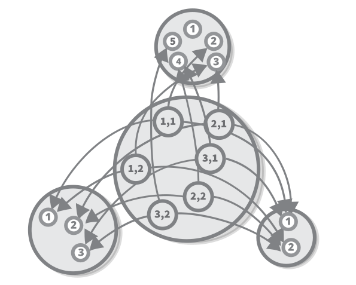
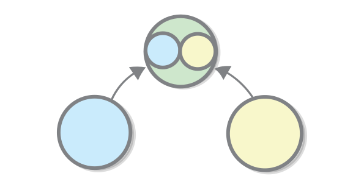
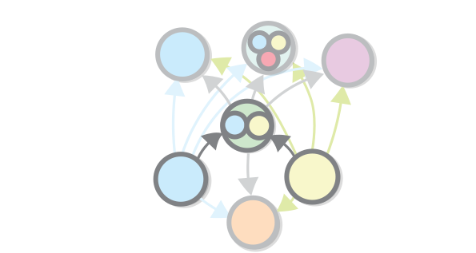

From Sets to Categories
===

In this chapter we will continue with set theory and we will start exploring categories, at the same time.

Products
===

During the previous chapter, we needed a way to make a set that is a composite of other sets that we already have. For example when we discussed mathematical functions, we couldn't define **+** and **-** functions, because we only knew about functions that take one argument. When we talked about programming, we talked about the primitive types, `Char` and `Number`, and we mentioned that most of the types are composite types. So how do we construct those?

The simplest composite, or a *product*, of the sets **B**, which contains **b**'s and the set**Y**, which contains **y**'s...

... is just the set of *pairs* of **b**'s and **y**'s.

The product is denoted **B x Y** and it comes equipped with two functions for retrieving the **b** and the **y** from each **(b, y)**.

Question: Why is this called a product? Hint: How many elements does it have?

Products as Objects
---

We established that in programming sets resemble types and functions resemble functions. Products, in this case, are like stripped-out *classes* (also called *records* or *structs*). The composite sets (the ones which form the product) are just the class's fields (also called *members*). The functions for accessing them are like what programmers call *getter methods*.

For example the famous OOP example of `Person` class with `name` and `age` fields is nothing more than a product of the set of strings, and the sets of numbers (we still haven't defined strings and lists in terms of set theory but we will get to that). Objects with more than two values can be expressed as products the composites of which are themselves products.

Using Products to Define Numeric Operations
---

Products can also be used for expressing functions which take more than one argument. For example, "plus" and "minus", are functions from set of the products of two numbers to the set of numbers. (so **+: R x R → R**). Of course, we cannot draw the function itself, even partly, because it has too much arrows and it would look messy.

Joking, here it is.

Note that there are languages where the *pair* datastructure (also called a *tuple*) is a first-level construct, and multi-argument functions are really implemented in this way. 

Defining products in Terms of Sets 
---

Now we will define the abstract concept of a product of two sets sets in terms of sets themselves. It is not hard: the product of two sets **Y** and **B** is just the set of all possible *ordered pairs*, which contain one element of the set **Y** and one element of the set **B**. Or formally speaking **Y x B = { (y, b) }** where **y ∈ Y, b ∈ B** (**∈** means "is an element of").

The real challenge is defining what a pair means in terms of sets. 

Note that the pair have to be *ordered*, so it cannot be just a set of two elements (formally speaking **A x B ≠ B x A for all A and B **). Some mathematical operations such as addition and multiplication don't care about order, but others, such as subtraction, do. And in programming we have the ability to assign names to each member of an object, which accomplishes the same purpose as ordering does for pairs.

So the pair must be ordered, and sets aren't. Turns out that that hasn't stopped mathematicians from coming up with multiple ingenious ways to represent an ordered pair using sets. Here is the first one, which was discovered by Norbert Wiener in 1914. The definition is notable for its smart use of the uniqueness of the empty set. 

The next one was discovered in the same year by Felix Hausdorff. In order to use that one, we just have to define "1", and "2" first.

Discovered in 1921 Kazimierz Kuratowski, this one uses just the component of the pair.

Defining products in Terms of Functions 
---

In the previous chapter we provided a definition of a product by *zooming in* the individual elements of the sets and seeing what they can be made of. This gave us a *low-level* view of products. This time we will try to do the opposite - be as oblivious to the contents of our sets as possible. Instead of zooming in we will zoom out, and try define the product in terms of functions and functional composition. Effectively we will be working at a higher level of abstraction.

So let's begin with an external diagram, showing the definition of the product. Disclaimer: I know that this is a somewhat weird notation, but don't worry, we will not be using it for very long.

This diagram already contains the first piece of the puzzle - the product of sets **Y** and **B**, the set **G**, has to have functions which give us back the elements of the product, so one function **G → Y** and one function **G → B**. 

This definition is not complete, however, because the product of **G** and **B** is not the only set which for which such functions can be defined. For example a set of triples of **Y x B x R** for some random element **R** also qualifies. If there is a function from **G** to **B** then the set **G** itself meets our condition for being the product, because it is connected to **B** and to itself. And depending on our specific case there can be many other other such objects.

So what do all these "imposter" sets have which can help us set them apart from the one true product? Simple - they all can be converted to it. This is so, because by definition the pair is nothing more than the sum of its elements, and by definition each impostor can be converted to both elements of the pair.

More formally, in order for a set **I** to serve as an impostor for the product of **B** and **Y** and there should be two functions, which we will call **b: I → B** and **y: I → Y**. In order to prove that **I** is an impostor we need a function **I → B x Y**. That function is simply (programmers will understand this best) **(a) → b(a) x y(a)** for each **a:I**.

Notice that this definition does not rule out the sets which are isomorphic to the product - when we represents things using functions, the isomorphism is equality.

Sum
===

We will now study a construct that is pretty similar to the product, but at the same time it is very different. Similar because, like the product, it is a relation between two sets which allows you to unite them into one, without erasing their structure. Different because it encodes a different type of relation between them - a product encodes an **AND** relation between two sets, while the sum encodes an **OR** relation. For example, a parent is either a mother of a father of a child, so the set of parent's is a sum set of the sets of mothers and fathers. 

Notice that the when a given object is an element of both sets, then it appears in the sum twice. This is why this type of sum of two sets is also called a *disjoint union*.

Defining Sums in Terms of Sets
---

Simply put, a sum of two sets is a set that contains all elements from the first set and all elements from the second one. But, as with the product, it is not so straightforward to represent sums in terms of sets. For example if two sets can have the same element as a member, their sum will have that element twice which is not permitted, because a set cannot contain the same element twice.

As with the product, the solution is to put some extra structure.

Like with the product, there is a low-level way to express a sum using sets alone. Incidentally, we can use pairs.

Defining Sums in Terms of Functions
---

You might already suspect, the interesting part is expressing the sum of two sets using functions. To do that we have to go back to the conceptual part of the definition. The sum expresses an **OR** relation between two things. A simple property of the **OR** relation is that if something is an **A** that something is also **A OR B**, and the same if it is **B**. For example if I am *a man*, I am also *a man OR a woman*. This is what **OR** means, right?

This relationship can be expressed as a function. Two functions actually - one for each set that takes part in the relation.

Why can it be expressed as a function? Because it is a *many-to-one* relationship (*one-to-one* if you want to be precise).

You might already notice that this definition is pretty similar to the previous one, and the similarities don't end here - here again we have sets that can be thought as *impostor* coproducts - ones for which these functions exists, but which aren't real coproduct, where by "real coproduct" we mean a set which expresses the *OR* relation and does just that. 

What are we saying with this, if we apply it to the parent example, is that the set of all parents is such that there is a function from mother   → parents and from fathers to parents.

Duality
===

If we have to compare the sum or the product, we can say that:

The *product* of two sets is related to an element of the first one *and* one element of the second one.
 A *sum* of two sets is related to an element of the first one *or*  one element of the second one.
