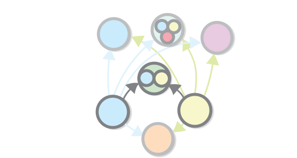
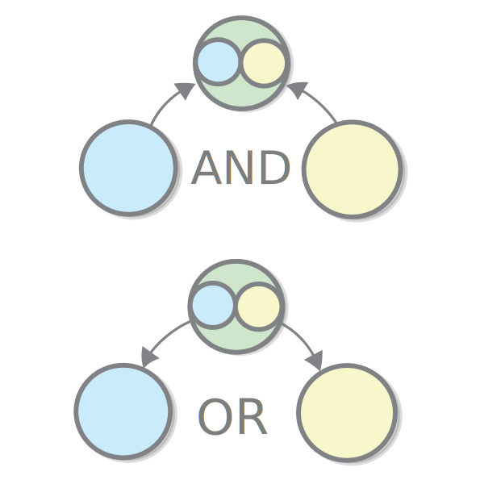

From Sets to Categories
===

In this chapter we will continue with set theory and at the same time we will start exploring categories.

Products
===

In the previous chapter, we needed a way to make a set that is a composite of other sets that we already have. For example when we discussed mathematical functions, we couldn't define **+** and **-** functions, because we only knew about functions that take one argument. When we talked about programming, we talked about the primitive types, `Char` and `Number`, and we mentioned that most of the types are composite types. So how do we construct those?

The simplest composite type, of the sets **B**, which contains **b**'s and the set**Y**, which contains **y**'s is the the *product* or **B** and **Y**.

It is the set of *pairs* of **b**'s and **y**'s.

The product is denoted **B x Y** and it comes equipped with two functions for retrieving the **b** and the **y** from each **(b, y)**.

Question: Why is this called a product? Hint: How many elements does it have?

Products as Objects
---

We established that in programming sets resemble types and functions resemble functions. Products, in this case, are like stripped-out *classes* (also called *records* or *structs*). The composite sets (the ones which form the product) are just the class's fields (also called *members*). The functions for accessing them are like what programmers call *getter methods*.

For example the famous OOP example of `Person` class with `name` and `age` fields is nothing more than a product of the set of strings, and the sets of numbers (we still haven't defined strings and lists in terms of set theory but we will get to that). Objects with more than two values can be expressed as products the composites of which are themselves products.

Using Products to Define Numeric Operations
---

Products can also be used for expressing functions which take more than one argument. For example, "plus" and "minus", are functions from the set of products of two numbers to the set of numbers. (so **+: R x R → R**). Of course, we cannot draw the function itself, even partly, because it has too much arrows and it would look messy.

Joking, here it is.

Note that there are languages where the *pair* datastructure (also called a *tuple*) is a first-level construct, and multi-argument functions are really implemented in this way. 

Defining products in Terms of Sets 
---

Now we will define the abstract concept of a product of two sets sets in terms of sets themselves. It is not hard: the product of two sets **Y** and **B** is just the set of all possible *ordered pairs*, which contain one element of the set **Y** and one element of the set **B**. Or formally speaking **Y x B = { (y, b) }** where **y ∈ Y, b ∈ B** (**∈** means "is an element of").

The real challenge is defining what a pair means in terms of sets. Note that the pair have to be *ordered*, so it cannot be just a set of the elements (formally speaking **A x B ≠ B x A for all A and B **). Some mathematical operations such as addition and multiplication don't care about order, but others, such as subtraction, do. And in programming we have the ability to assign names to each member of an object, which accomplishes the same purpose as ordering does for pairs.

So the pair must be ordered, and sets aren't. Turns out that that hasn't stopped mathematicians from coming up with multiple ingenious ways to represent an ordered pair using sets. Let's see them, just for fun. Here is the first one, which was discovered by Norbert Wiener in 1914. The definition is notable for its smart use of the uniqueness of the empty set. 

The next one was discovered in the same year by Felix Hausdorff. In order to use that one, we just have to define "1", and "2" first.

Discovered in 1921 Kazimierz Kuratowski, this one uses just the component of the pair.

Defining products in Terms of Functions 
---

In the previous chapter we provided a definition of a product by *zooming in* the individual elements of the sets and seeing what they can be made of. This gave us a *low-level* view of products. This time we will try to do the opposite - be as oblivious to the contents of our sets as possible. Instead of zooming in we will *zoom out*, and try define the product in terms of functions and functional composition. Effectively we will be working at a *higher level* of abstraction.

So let's begin with an external diagram, showing the definition of the product. Disclaimer: I know that this is a somewhat weird notation, but don't worry, we will not be using it for very long.

This diagram already contains the first piece of the puzzle if we have a set **G** which is the product of sets **Y** and **B**, then we should also have functions which give us back the elements of the product, so **G → Y** and **G → B**. 

This definition is not complete, however, because the product of **G** and **B** is not the only set for which such functions can be defined. For example a set of triples of **Y x B x R** for some random element **R** also qualifies. And if there is a function from **G** to **B** then the set **G** itself meets our condition for being the product, because it is connected to **B** and to itself. 

Depending on our specific case there can be many other other such objects.

So how do we set apart all those "imposter" products from the one true product? Simple - they all can be converted to it. This is true, because by definition the pair is nothing more than the sum of its elements, and by definition each impostor can be converted to both elements of the pair.

More formally, in order for a set **I** to serve as an impostor for the product of **B** and **Y** and there should be two functions, which we will call **b: I → B** and **y: I → Y**. In order to prove that **I** is an impostor we need a function **I → B x Y**. That function is simply (programmers will understand this best) **(a) → b(a) x y(a)** for each **a:I**.

Notice that this definition does not rule out the sets which are isomorphic to the product - when we represents things using functions, the isomorphism is equality.

Sum
===

We will now study a construct that is pretty similar to the product, but at the same time it is very different. Similar because, like the product, it is a relation between two sets which allows you to unite them into one, without erasing their structure. Different because it encodes a different type of relation between them - a product encodes an **AND** relation between two sets, while the sum encodes an **OR** relation. For example, a parent is either a mother of a father of a child, so the set of parent's is a sum set of the sets of mothers and fathers. 

Notice that the when a given object is an element of both sets, then it appears in the sum twice. This is why this type of sum of two sets is also called a *disjoint union*.

Question: Why is this called a sum? 

Defining Sums in Terms of Sets
---

Simply put, a sum of two sets is a set that contains all elements from the first set and all elements from the second one. But, as with the product, it is not so straightforward to represent sums in terms of sets. For example if two sets can have the same element as a member, their sum will have that element twice which is not permitted, because a set cannot contain the same element twice.

As with the product, the solution is to put some extra structure.

Like with the product, there is a low-level way to express a sum using sets alone. Incidentally, we can use pairs.

Defining Sums in Terms of Functions
---

You might already suspect, the interesting part is expressing the sum of two sets using functions. To do that we have to go back to the conceptual part of the definition. The sum expresses an **OR** relation between two things. A simple property of every **OR** relation is that if something is an **A** that something is also **A OR B**, and the same if it is **B**. For example if I am *a man*, I am also *a man OR a woman*. This is what **OR** means, right?

This relationship can be expressed as a function. Two functions actually - one for each set that takes part in the relation.

Why can it be expressed as a function? Because it is a *many-to-one* relationship (*one-to-one* if you want to be precise).

You might already notice that this definition is pretty similar to the previous one, and the similarities don't end here - here again we have sets that can be thought as *impostor* sums - ones for which these functions exists, but which aren't real sums, where by "real sum" we mean a set which expresses the *OR* relation and does just that (so no additional structure). 

What are we saying with this, if we apply it to the example, is simply that if parents are either mothers or fathers, then there surely exist a functions **mothers → parents** and **fathers → parents**.

Duality 
===

If we have to compare the concepts of sum or and product we will find out that they are related:

- The *product* of two sets is related to an element of the first one *and* one element of the second one.
- A *sum* of two sets is related to an element of the first one *or* one element of the second one.

Actually, the two concepts are captured by one and the same external diagram, just the arrows are flipped - many-to-one relationships become one-to-many and the other way around:

When two concepts are captured by the same diagram, only with reversed arrows, we can say that the two concepts are **dual** to each other. So *product* and *sum* are dual. This is why sum is also known as *coproduct* in the context of category theory. This is the best example of how external diagrams (and category theory) allow us to formalize connections between different objects that we previously knew by intuition. The connection between *OR* and *AND* has always been there - ever since 19 century when Boolean algebra was discovered, its existence has been demonstrated. For example, its not hard to convince ourselves that the expression **NOT (A AND B)** is equivalent to **(NOT A) OR (NOT B)**, or, to put it in everyday language, if you don't like the the combination of ham **AND** cheese, then you should order either something that does not contain ham **OR** something that does not contain cheese. But how does that **AND** magically turn into to **OR** when we remove the brackets? The answer could not be expressed without category theory.

Category Theory - brief definition
===

Maybe it is time to see what a category theory is all about. Well, a category theory is about objects (an example of which are sets) and morphisms which go from one object to another (which can be viewed as functions) and which should be composable. We can say a lot more about categories, and even present a formal definition, but for now it is suffice for you to remember that sets are one example of a category and that categorical objects are like sets, except that we don't see their elements. This and what I said before, about category theoretic notions being captured by the external diagrams and set-theoretic notions being captured by internal diagrams.

What other categories, or applications of category theory are there, other than sets? We already discussed one - types in programming languages. Remeber that we said that programming types (classes) are somewhat similar to sets and programming functions are somewhat similar to functions between sets? This is another example of a connection that we can made rigorous using category theory.

| Category Theory | Set theory | Programming Languages |
| ---             | ---        | ---                   |
| Category        | N/A        | N/A                   |
| Objects and  Morphisms        | Sets and Functions   | Classes and functions |
| N/A             | Element    | Object                |

This diagram illustrates how category theory allows us to see the big picture when it comes to sets and similar structures - when we are at the realm of sets we can view the set as a collection of individual elements. In category theory we don't have such notion. We saw how taking the notion away allows us to define concepts such as the sum and product sets in a whole different and more general way. 

In addition we have the notion of a category. The whole realm of sets, can be thought as one category. A programming language can also be thought as a category. And there are a lot more categories which are interesting and useful.

Do note how the world "Object" is used in both programming languages and in category theory, but for completely different things. The equivalent a categorical object is equivalent to a class in programming language.

Limits
===

Products are one example of what is known in category theory as *limits*. A limit is an object that summarizes a structure (also called a diagram) consisting of other objects and morphisms in a way that allows us to later retrieve some of it.

A limit also has to be unique in the sense that you cannot have two limit objects for the same structure.

Limits also are defined so that the diagram commutes. 

Limits can be defined formally, just like everything else that we examine, but we won't bother to do that here.

Products are Limits
---

OK, we said that limits summarize a structure. What is the structure that a product is summarizing? It is a structure that consists of two objects (sets) that are have no connections between them.
 

 
Why is the product unique when it comes to representing the two objects? Because any other object that also represents them is connected to the product through a morphism (this is known as the *universal property* of limits).

