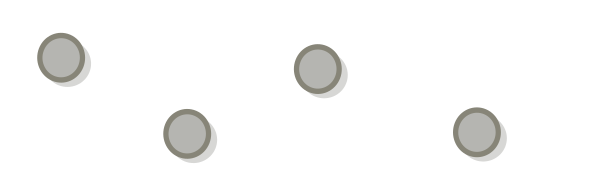
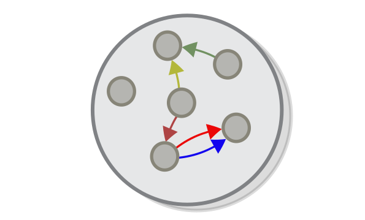

Some other categories
===

Every category theory guide (including mine) starts by talking about set theory. However looking back I really don't know why that is the case (most books that center around a specific subject don't start by introducing a different subject). Perhaps the set-first approach is the best way to introduce people to categories, or perhaps that is just one of the things that people just do, simply because everyone else does it. 

One thing is for sure - we don't need to study sets in order to understand categories. So in this chapter I would like to start over and talk about categories as a first concept.

Starting over with categories
===

So, a category is a collection of objects (things) where the "things" can be anything you want. Consider, for example, these colourful balls that we saw last time: 

A category consists of a collection of objects **as well as** some arrows connecting some of them, that we call (the arrows) morphisms.

Wait a sec so we said that all sets form a category, but at the same time just one set can be seen as a category by itself with, just one which has no morphisms. This is an example of a phenomenon that is very characteristic of category theory - one object can be examined in many different ways.

The analogy of a set as a category with no morphisms is, however, is not very useful, simply because category theory **is all about the morphisms**. If in set theory an arrow is nothing but a pointer from a source to a destination, in category theory an object is nothing but a source and destination for the arrows that are involved in. In category theory objects can be connected by multiple arrows, each of which is unique, this is why objects in this chapter are all grey, while the arrows are in different colours:

