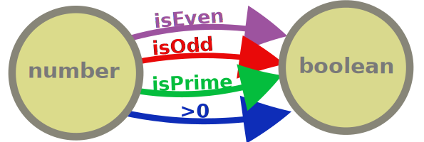
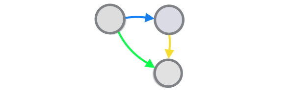
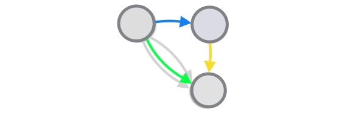
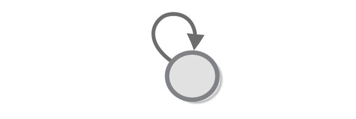

Some Other Categories
===

Every category theory guide (including mine) starts by talking about set theory. However, looking back, I really don't know why that is the case - surely most other books that focus around a specific subject don't start by introducing an entirely different subject. Perhaps the set-first approach is the best way to introduce people to categories. or perhaps using sets to introduce categories is just one of the things that people just do, simply because everyone else does it. But one thing is for sure - we don't need to study sets in order to understand categories. So in this chapter I would like to start over and talk about categories as a first concept. So pretend like it's a new book:

Starting over with categories
===

So, a category is a collection of objects (things) where the "things" can be anything you want. Consider, for example, these ~~colourful~~ grey balls:

A category consists of a collection of objects as well as some arrows connecting some of them to one another, that we call (the arrows) morphisms.

Wait a minute - we said that all sets form a category, but at the same time any one set can be seen as a category on its own right (just one which has no morphisms). This is true and an example of a phenomenon that is very characteristic of category theory - one structure can be examined from many different angles and may play many different roles, often in a recursive fashion.

This particular analogy (a set as a category with no morphisms) is, however, not very useful. Not because it's in any way incorrect, but because category theory is *all about the morphisms*. If in set theory arrows are nothing but a connection between a source and a destination, in category theory it's the *objects* that are nothing but a source and destination for the arrows that connect them to other objects. This is why, in the diagram above, the arrows, and not the objects, are coloured: the category of sets should really be called the category of set functions.

Speaking of which, note that objects in a category can be connected by multiple arrows and that arrows having the same domain and codomain does not in any way make them equivalent.

Why is that is pretty obvious if we go back to set theory for a second (OK, maybe we really *have* to do this from time to time) - there are, for example, an infinite number of functions that go from number to boolean and the fact that they have the same input type and the same output type (or the same *type signature*, as we like to say) does not in any way make them equivalent to one another.

Composition
---

One of the few, or maybe even the only, requirement for a structure to be called a category is that two morphisms can make a third, or in other words that morphisms are *composable* - given two successive arrows with appropriate type signature, we can draw a third one that is equivalent to the consecutive application of the other two.

Formally, this requirement says that there should exist an operation (denoted with the symbol **•**) such that for each two functions **g: A → B** and **f: B → C**, there exists exactly one function **(f • g): A → C**.

**NB:** Note that functional composition is written from right to left. e.g. applying **g** and then applying **f** is written **f • g** and not the other way around (you can think of it as a shortcut to **f(g(a))**).

Again, note that this criteria is not met by just *any* morphism with this type signature. There is *exactly one* morphism that fits these criteria and there may be some which don't.

Commuting diagrams
---

The diagram above, uses colors to illustrate the fact that the green morphism is equivalent to the other two (and not just some unrelated morphism), but in practice this notation is a little redundant - the only reason to draw diagrams with arrows in the first place is represent paths between objects that are equivalent to each other, all other paths just belong in different diagrams. For this reason, we can drop the colors from our diagrams.

Diagrams that are like that (ones in which any two paths between two objects are equivalent to one another) are called *commutative diagrams* (or diagrams that *commute*). All diagrams that we have here (except the wrong ones) commute.

The law of associativity
---

Functional composition is special not only because you can take any two morphisms with appropriate signatures and make a third, but because you can do so indefinitely, i.e. given **n** successive arrows, each of which starts from the object that the other one finishes, we can draw one (exactly one) arrow that is equivalent to the consecutive application of all **n** arrows.

This approach for building stuff is often used in programming. To see some examples, you don't need to look further than the way the pipe operator in bash (`|`), that feeds the standard output of a program with the standard input of another program, is (ab)used (if you *want* to look further, note that there is a whole programming paradigm based on functional composition, called "concatenative programming").

But let's get back to the math. If we carefully review the definition above can see that it can be reduced to multiple applications of the following formula: given 4 objects and 3 morphisms between them **f** **g** **h**, combining **h** and **g** and then combining the end result with f** should be the same as combining **h** to the result of **g** and **f** (or simply **(h • g) • f = h • (g • f)**. 

**Task:** show how the definition can be reduced to the formula (the approach resembles mathematical induction).

This formula is true if and only if this diagram commutes. 

Given that all our category-theoretic diagrams commute, we can say, in such cases, that the formula and the diagram are equivalent.

This formula (and the diagram) is the definition of a property called **associativity**. Being associative is required for functional composition to really be called functional composition (and for a category to really be called category), if only because it is required for us to be able to draw diagrams of a category's objects and morphisms, as diagrams can only represent associative structures (if the diagram above does not commute it would be super weird).

Associativity is not just about diagrams, for example when we express relations using formulas, associativity just means that brackets don't matter, in our formulas (as evidenced by the definition **(h • g) • f = h • (g • f)**). And it is not only about categories either, it is a property of many other operations on other types of objects as well e.g. if we look at numbers, we can see that the multiplication operation is associative e.g. **(1 . 2) . 3 = 1 . (2 . 3)**. While division is not **(1 / 2) / 3 = 1 / (2 / 3)**.

Identity
---

Arabic mathematicians invented the number zero that, although useless by itself, allowed them to define many useful numbers. In order to be able to define more stuff using morphisms in category theory, we too would want to define what we call the "identity morphism" for each object. In short, this is a morphism, that doesn't do anything.

It's important to mark this morphism, because there can be (let's add the very important (and also very boring) reminder) many morphisms that go from one object to the same object, many of which actually do stuff. For example mathematics deals with a multitude of functions that have the set of numbers as domain and codomain, such as **negate**, **square**, **add one**, and are not at all the identity morphism.

**Question:** What is the identity morphism in the category of sets?

Why do we need to define a morphism that does nothing? 

Isomorphisms
---

Once we have the concept of identity morphism defined we can have a category-theoretic definition of an isomoprhism (which is important, because the concept of an isomorphism is very important for cathegory theory): An isomorphism between two objects (**A** and **B**) consists of two morphisms - (**A → B**.  and **B → A**) such that their compositions are equivalent to the identity functions of the respective objects. 

Here is how this looks when expressed using a formulas:

Objects **A** and **B** are isomorphic 
iff there exist mophisms 
**f: A → B**
**g: B → A** 
such that  
**f • g = idB** 
**g • f = idA** 

And here is the same thing expressed with a commuting diagram.

Like the example with the law of associativity, the diagram expresses the same (simple) fact as the formula, namely that going from the one of objects (**A** and **B**) to the other one and then back again is the same as applying the identity morphism i.e. doing nothing. 

A summary
---

For future reference, let's repeat what a category is.

A category is a collection of **objects** (we can think of them as points) and **morphisms** (arrows) that go from one object to another, where:
1. There should be a way to compose two morphisms with an appropriate type signature into a third one in a way that is associative.
2. Each object has to have the identity mophism.

This is it.

Monoids and groups
===

Since we are done with categories, let's look at some other structures that are also interesting - like categories, monoids/groups are also abstract systems consisting of objects and rules for manipulating these objects. 

A monoid is defined by a collection of objects and an operation that allows us to combine two objects and produce a third one.

Orders
===
TBD

Algebras
===
TBD
