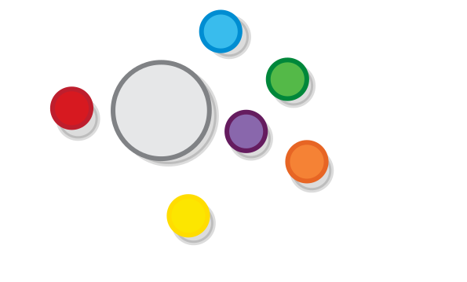
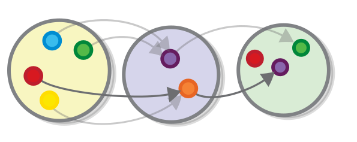
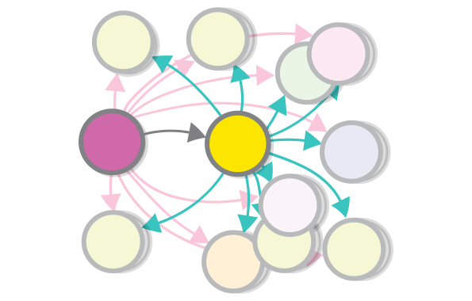
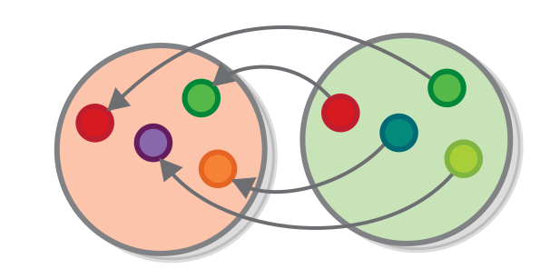
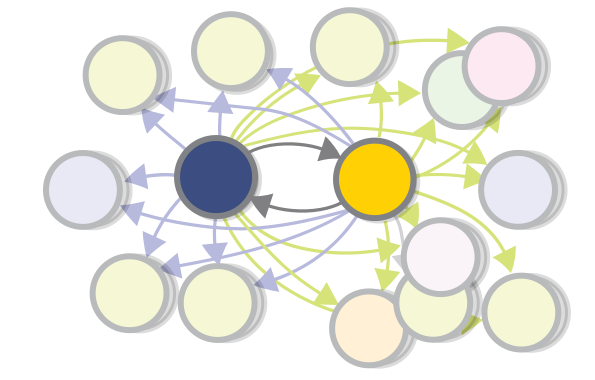

Sets
===

Let's begin our inquiry by looking at the basic theory of sets. Set theory and category theory share many similarities. We can view category theory as a *generalization* of set theory. That is, it's meant to describe the same thing as set theory (everything?), but to do it in a more abstract manner, one that is more versatile and (hopefully) simpler. 

In other words, sets are an *example of a category* (the *proto-example*, we might say), and it is useful to have examples. 

What is an Abstract Theory
===

> Instead of asking what can be defined and deduced from what is assumed to begin with, we ask instead what more general ideas and principles can be found, in terms of which what was our starting-point can be defined or deduced.
> Bertrand Russell, from Introduction to Mathematical Philosophy

Most scientific and mathematical theories have a specific *domain*, which they are tied to, and in which they are valid. They are created with this domain in mind and are not intended to be used outside of it. For example, Darwin's theory of evolution is created in order to explain how different *biological species* came to evolve using natural selection, quantum mechanics is a description of how particles behave at a specific scale, etc.

Even most mathematical theories, although not inherently *bound* to a specific domain like the scientific ones, are often strongly related to one, as differential equations are linked to how events change over time. 

Set theory and category theory are different, they are not created to provide a rigorous explanation of how a particular phenomenon works, instead they provide a more general framework for explaining all kinds of phenomena. They work less like tools and more like languages for defining tools. Theories that are like that are called *abstract* theories. 

The borders of the two are sometimes blurry, because all theories *use abstraction*, otherwise they would be pretty useless: without abstraction Darwin would have to speak about specific animal species or even individual animals. But theories have core concepts that don't refer to anything in particular, but are instead left for people to generalize on. All theories are applicable outside of their domains, but set theory and category theory do not have a domain to begin with.

Concrete theories, like the theory of evolution, are composed of concrete concepts. For example, the concept of a *population*, also called a *gene-pool*, refers to a group of individuals that can interbreed. Abstract theories, like set theory, are composed of abstract concepts, like the concept of a set. The concept of a set by itself does not refer to anything. However, we cannot say that it is an empty concept, as there are countless things that can be represented by sets, for example, gene pools can be (very aptly) represented by sets of individual animals. Animal species can also be represented by sets &mdash; a set of all populations that can theoretically interbreed.

You've already seen how abstract theories may be useful. Because they are so simple, they can be used as building blocks to many concrete theories. Because they are common, they can be used to unify and compare different concrete theories, by putting these theories in common grounds (this is very characteristic of category theory, as we will see later). Moreover, good (abstract) theories can serve as *mental models* for developing our thoughts. 

<!-- comic - brain on category theory -->

<!--
People have tried to be precise and at the same time down to Earth for centuries, and only recently discovered that "precise and down to Earth" is an oxymoron. Let's take Euclidean geometry as an example. Yes, Euclidean geometry is precise, because it is valid for all sets of objects, called ("point", "line", "angle", "circle", etc.), which have relationships, as defined by the five famous axioms. Yes, geometry does, in many instances, describe the natural world, because there are many sets of objects which have these relations. However, its "precise" part and its "down to Earth" part have nothing to do with each other. We can, for example, define a point as any stain on the floor of your room and a line as a piece of duct tape, put on the same floor. That will be a completely valid application of the Euclidean laws, albeit not very useful one. Or we can try to use geometry to reason about points on the surface of the Earth, which is a very useful application of geometry, however not of Euclidean geometry, because Euclidean geometry only describes points on a flat plane, and the Earth is not flat. You can argue that these are actually two separate theories there, which just happen to be perceived as one. You have the axioms, or the postulates on one hand, which are not useful for anything on their own, and you have applications in science and engineering which are somewhat based on them, but not quite. 
-->

Sets
===

> “A set is a gathering together into a whole of definite, distinct objects of our perception or of our thought—which are called elements of the set.” – Georg Cantor

Perhaps unsurprisingly, everything in set theory is defined in terms of sets. A set is a collection of things where the "things" can be anything you want (like individuals, populations, genes, etc.) Consider, for example, these balls.

Let's construct a set, call it $G$ (as gray) that contains *all* of them as elements. There can only be one such set: because a set has no structure (there is no order, no ball goes before or after another, there are no members which are "special" with respect to their membership of the set.) Two sets that contain the same elements are just two pictures of the same set.

This example may look overly-simple, but in fact, it's just as valid as any other.

The key insight that makes the concept useful is the fact that it enables you to reason about several things as if they were one.
 
Subsets 
---

Let's construct one more set. The set of *all balls that are warm in color*. Let's call it $Y$ (because in the diagram, it's colored in **y**ellow).

Notice that $Y$ contains only elements that are also present in $G$. That is, every element of the set of $Y$ is also an element in the set $G$. When two sets have this relation, we may say that $Y$ is a *subset* of $G$ (or $Y \subseteq G$). A subset resides completely inside its superset when the two are drawn together.

Singleton Sets
---

The set of all *red balls* contains just one ball. We said above that sets summarize *several* elements into one. Still, sets that contain just one element are perfectly valid &mdash; simply put, there are things that are *one of a kind*. The set of kings/queens that a given kingdom has is a singleton set. 

What's the point of the singleton set? Well, it is part of the language of set theory, e.g., if we have a function which expects a set of given items, but if there is only one item that meets the criteria, we can just create a singleton set with that item.

The Empty set
---

Of course if one is a valid answer, zero can be also. If we want a set of all *black balls*  $B$ or all the *white balls*, $W$, the answer to all these questions is the same &mdash; the empty set.

Because a set is defined only by the items it contains, the empty set is *unique* &mdash; there is no difference between the set that contains zero *balls* and the set that contains zero *numbers*, for instance. Formally, the empty set is marked with the symbol $\varnothing$ (so $B = W = \varnothing$).

The empty set is a special one, for example, it is a subset of every other set or mathematically speaking, $\forall A  \to \varnothing \subseteq A$ ($\forall$ means "for all")

Functions
===

> "By function I mean the unity of the act of arranging various representations under one common representation." --- Immanuel Kant, from "The Critique of Pure Reason"

A function is a relationship between two sets that matches each element of one set, called the *source set* of the function, with exactly one element from another set, called the *target set* of the function. 

These two sets are also called the *domain* and *codomain* of the function, or its *input* and *output*.  In programming, they go by the name of *argument type* and *return type*. In logic, they correspond to the *premise* and *conclusion* (we will get there). We might also say, depending on the situation, that a given function *goes* from this set to that other one, *connects* this set to the other, or that it *converts* a value from this set to a value from the other one. These different terms demonstrate the multifaceted nature of the concept of function.

Different types of functions
---

Here is a function $f$, which converts each ball from the set $R$ to the ball with the opposite color in another set $G$ (in mathematics a function's name is often accompanied by the names of its source and target sets, like this: $f: R → G$)

This is probably one of the simplest type of functions that exist &mdash; one which encodes a *one-to-one relationship* between the sets &mdash; *one* element from the source is connected to exactly *one* element from the target (and the other way around).

But functions can also express relationships of the type *many-to-one*, where *many* elements from the source might be connected to *one* element from the target (but not the other way around). For example, a function can express a relationship in which several elements from the source set relate to the same element of the target set.

Such functions might represent operations such as *categorizing* a given collection of objects by some criteria, or partitioning them, based on some property that they might have.

A function can also express relationships in which some elements from the target set do not play a part.

An example might be the relationship between some kind of pattern or structure and the emergence of this pattern in some more complicated context.

We saw how versatile functions are, but there is one thing that you cannot have in a function. You cannot have a source element that is not mapped to anything, or that is mapped to more than one target element &mdash; that would constitute a *many-to-many* relationship and as we said functions express many-to-one relationships. There is a reason for that "design decision", and we will arrive at it shortly.

Functions in everyday life
---

Sets and functions can express relationships between all kinds of objects, and even people. Every question that you ask that has an answer can be expressed as a function.

The question "How far are we from New York?" is a function with set of all places in the world as source set and its target set consisting of the set of all positive numbers.

The question "Who is my father?" is a function whose source is the set of all people in the world.

**Question:** What is the target of this function?

Note that the question "Who is my child?" is *NOT* a straightforward function, because a person can have no children, or can have multiple children. We will learn to represent such questions as functions later.

**Question:** Do all functions that we drew at the beginning *express* something? Do you think that a function should express something in order to be valid? 

The Identity Function
---

For every set $G$, no matter what it represents, we can define the function that does nothing, or in other words, a function which maps every element of $G$ to itself. It is called *the identity function* of $G$ or $ID_{G}: G → G$.

You can think of $ID_{G}$ as a function which represents the set $G$ in the realm of functions. Its existence allows us to prove many theorems, that we "know" by intuition, formally.

Functions and Subsets
---

For each set and subset, no matter what they represent, we can define a function (called the *image* of the subset) that maps each element of the subset to itself:

Every set is a subset of itself, in which case this function is the same as the identity.

Functions and the Empty Set
---

There is a unique function from the empty set to any other set.

**Question:** Is this really valid? Why? Check the definition.

Note that this statement is also a result from the one saying that there is a function between a Subset and a Set, and the one that says that the empty set is a subset of any other set.

**Question:** What about the other way around. Are there functions with the empty set as a target as opposed to its source?

Functions and Singleton Sets
---

There is a unique function from any set to any singleton set.

**Question:** Is this really the only way to connect *any* set to a singleton set in a valid way?

**Question:** Again, what about the other way around?

Sets and Functions with numbers
===

All numerical operations can be expressed as functions, acting on the set of (different types of) numbers. 

Number sets
---

Because not all functions work on all numbers, we separate the set of numbers to several sets, many of which are subsets to one another, such the set of whole numbers $\mathbb{Z} := {... -3 -2, -1, 0, 1, 2, 3... }$, the set of positive whole numbers, (also called "natural" numbers), $\mathbb{N} := {1, 2, 3... }$. We also have the set of Real numbers $\mathbb{R}$, which includes almost all numbers and the set of positive real numbers (or $\mathbb{R}_{>0}$). 

Number functions
---

Each numerical operation is a function between two of these sets. For example, squaring a number is a function from the set of real numbers to the set of real non-negative numbers (because both sets are infinite, we cannot draw them in their entirety, however we can draw a part of them).

I will use the occasion to reiterate some of the more important characteristics of functions:

- All numbers from the target have (or should have) two arrows pointing at them (one for the positive square root and one for the negative one), and that is OK. 
- Zero from the source set is connected to itself in the target set &mdash; that is permitted.
- Some numbers aren't the square of any other number &mdash; that is also permitted.

Overall everything is permitted, as long as you can always provide exactly one result (also known as *The result™*) per value. For numerical operations, this is always true, simply because math is designed this way.

> Every generalization of number has first presented itself as needed for some simple problem: negative numbers were needed in order that subtraction might be always possible, since otherwise a − b would be meaningless if a were less than b; fractions were needed in order that division might be always possible; and complex numbers are needed in order that extraction of roots and solution of equations may be always possible.  
> Bertrand Russell, from Introduction to Mathematical Philosophy

Note that most mathematical operations, such as addition, multiplication, etc. require two numbers in order to produce a result. This does not mean that they are not functions. It means that they are just a little more fancy ones. Depending on what we need, we may present those operations as functions from the sets of *tuples* of numbers to the set of numbers, or we may say that they take a number and return a function. More on that later.

Sets and Functions in Programming
===

Sets are used extensively in programming, especially in their incarnation as *types* (also called *classes*). All sets of numbers that we discussed earlier also exist in most languages as types.

Sets and types
---

Sets are not exactly the same thing as types, but all types are (or can be seen as) sets. For example, we can view the `Boolean` type as a set containing two elements &mdash; `true` and `false`.

Another very basic set in programming is the set of keyboard characters, or `Char`. Characters are actually used rarely by themselves and mostly as parts of sequences.

Most of the types of programming are composite types &mdash; they are a combination of the primitive ones that are listed here. Again, we will cover these later.

**Question:** What is the type equivalent of subsets in programming?

Functions and methods/subroutines
---

Some functions in programming (also called methods, subroutines, etc.) kinda resemble mathematical functions &mdash; they sometimes take one value of a given type (or in other words, an element that belongs to a given set) and always return exactly one element which belongs to another type (or set). For example, here is a function that takes an argument of type `Char` and returns a `Boolean`, indicating whether the character is a letter.

However functions in most programming languages can also be quite different from mathematical functions &mdash; they can perform various operations that have nothing to do with returning a value. These operations are sometimes called side effects. 

Why are functions in programming different? Well, figuring a way to encode *effectful* functions in a way that is mathematically sound isn't trivial and at the time when most programming paradigms that are in use today were created, people had bigger problems than the their functions not being mathematically sound (e.g. actually being able to run any program at all). 

Nowadays, many people feel that mathematical functions are too limiting and hard to use. And they might be right. But mathematical functions have one big advantage over non-mathematical ones &mdash; their type signature tells you almost everything about what the function does (this is probably the reason why most functional languages are strongly-typed).

Purely-functional programming languages
---

We said that while all mathematical functions are also programming functions, the reverse is not true for *most* programming languages. There are some languages that don't permit non-mathematical functions, and for which this equality holds. They are called *purely-functional* programming languages.

A peculiarity in such languages is that they don't support functions that perform operations like rendering stuff on screen, doing I/O, etc. (in this context, such operations are called "side effects".

In purely functional programming languages, such operations are *outsourced* to the language's runtime. Instead of writing functions that directly permform a side effect, for example `console.log('Hello')`, we write functions that return a type that represents that side effect (for example, in Haskell side effects are handled by the `IO` type) and the runtime then executes those functions for us. 

We then link all those functions into a whole program, often by using a thing called *continuation passing style*.

Functional Composition 
===

Now, we were just about to reach the heart of the matter regarding the topic of functions. And that is functional composition. Assume that we have two functions, $g: Y → P$ and $f: P → G$ and the target of the first one is the same set as the source of the second one.

If we apply the first function $g$ to some element from set $Y$, we will get an element of the set $P$. Then, if we apply the second function $f$ to *that* element, we will get an element from type $G$.

We can define a function that is the equivalent to performing the operation described above. 
That would be a function such that, if you follow the arrow $h$ for any element of set $Y$ you will get to the same element of the set $G$ as the one you will get if you follow the $g$ and then follow $f$.

Let us call it $h: Y → G$. We may say that $h$ is the *composition* of $g$ and $f$, or $h = f \circ g$ (notice that the first function is on the right, so it's similar to $b = f(g(a)$).

Composition is the essence of all things categorical. The key insight is that the sum of two parts is no more complex than the parts themselves.  

**Question:** Think about which qualities of a function make composition possible, e.g., does it work with other types of relationships, like many-to-many and one-to-many.

Composition of relationships
---

To understand how powerful composition is, consider the following: one set being connected to another means that each function from the second set can be transferred to a corresponding function from the first one.

If we have a function $g: P → Y$ from set $P$ to set $Y$, then for every function $f$ from the set $Y$ to any other set, there is a corresponding function $f \circ g$ from the set $P$ to the same set. In other words, every time you define a new function from $Y$ to some other set, you gain one function from $P$ to that same set for free.

For example, if we again take the relationship between a person and his mother as a function, with the set of all people in the world as source, and the set of all people that have children as its target, composing this function with other similar functions would give us all relatives on a person's mother side.

Although you might be seeing functional composition for the first time, the intuition behind it is there &mdash; we all know that each person whom our mother is related to is automatically our relative as well &mdash; our mother's father is our grandfather, our mother's partner is our father, etc.

Composition in engineering
---

Besides being useful for *analyzing* relationships that already exist, the principle of composition can help you in the practice of *building* objects that exhibit such relationships i.e. engineering. 

One of the main ways in which modern engineering differs from ancient craftsmanship is the concept of a *part/module/component* - a product that performs a given function that is not made to be used directly, but is instead optimized to be combined with other such products in order to form a "end-user" product. For example, an *espresso machine* is just a combination of the components, such as , *pump, heater, grinder group* etc, when composed in an appropriate way.

**Task:** Think about what would be those functions' sources and targets.

By the way, diagrams that are "zoomed out" that show functions without showing set elements are called *external diagrams*, as opposed to the ones that we saw before, which are *internal*. 

Composition and external diagrams 
---

Let's look at the diagram that demonstrates functional composition in which we showed that successive application of the two composed functions ($f \circ g$) and the new function ($h$) are equivalent.

We showed this equivalence by drawing an *internal* diagram, and explicitly drawing the elements of the functions' sources and targets in such a way that the two paths are equivalent.

Alternatively, we can just *say* that the arrow paths are all equivalent (all arrows starting from a given set element ultimately lead to the same corresponding element from the resulting set) and draw the equivalence as an external diagram.

The external diagram is a more appropriate representation of the concept of composition, as it is more general. In fact, it is *so* general that it can actually serve as a *definition of functional composition*.

> The composition of two functions $f$ and $g$ is a third function $h$ defined in such a way that all the paths in this diagram are equivalent.

If you continue reading this book, you will hear more about diagrams in which all paths are equivalent (they are called *commuting diagrams*, by the way)

At this point you might be worried that I had forgotten that I am supposed to talk about category theory and I am just presenting a bunch of irrelevant concepts. I may indeed do that sometimes, but not right now - the fact that *functional composition* can be presented without even mentioning category theory doesn't stop it from being one of category theory's *most important concepts*. 

In fact, we can say (although this is not an official definition) that category theory is the study of things that are *function-like* (we call them *morphisms*) --- ones that have source and target, that can be composed with one another in an associative way, that can be represented by external diagrams etc.

And there is another way of defining category theory without defining category theory: it is what you get if you replace the concept of equality with the concept of *isomorphism*. We haven't talked about isomorphisms yet, but this is what we will be doing till the end of this chapter.

Isomorphism
===

To explain what isomorphism is, we go back to the examples of the types of relationships that functions can represent, and to the first and most elementary of them all &mdash; the *one-to-one* type of relationship. We know that all functions have exactly one element from the source set, pointing to one element from the target set. But for one-to-one functions *the reverse is also true* &mdash; exactly one element from the target set points to one element from the source. 

If we have a one-one-function that connects sets that are of the same size (as is the case here), then this function has the following property: all elements from the target set have exactly one arrow pointing at them. In this case, the function is *invertible*. That is, if you flip the arrows of the function and its source and target, you get another valid function.

Invertible functions are called *isomorphisms*. When there exists an invertible function between two sets we say that the sets are *isomorphic*. For example, because we have an invertible function that converts the temperature measured in *Celsius* to temperature measured in *Fahrenheit*, and vise versa, we can say that temperatures measured in Celsius and Fahrenheit are isomorphic.

Isomorphism means "same form" in Greek (although actually their form is the only thing which is different between two isomorphic sets).

More formally, two sets $R$ and $G$ are isomorphic (or $R ≅ G$) if there exist functions $f: G → R$ and its reverse $g: R → G$, such that $f \circ g = ID_{R}$ and $g \circ f = ID_{G}$ (notice how the identity function comes in handy).

Isomorphism and identity
---

If you look closely you would see that the identity function is invertible too (its reverse is itself), so each set is isomorphic to itself in that way.

Therefore, the concept of an isomorphism contains the concept of equality &mdash; all equal things are also isomorphic.

Isomorphism and composition
---

An interesting fact about isomorphisms is that if we have functions that convert a member of set $A$ to a member of set $B$, and the other way around, then, because of functional composition, we know that any function from/to $A$ has a corresponding function from/to $B$.

For example, if you have a function "is the partner of" that goes from the set of all married people to the same set, then that function is invertible. That is not to say that you are the same person as your significant other, but rather that every statement about you, or every relation you have to some other person or object is also a relation between them and this person/object, and vice versa. 

Composing isomorphisms
---

Another interesting fact about isomorphisms is that if we have two isomorphisms that have a set in common, then we can obtain a third isomorphism between the other two sets that would be the result of their (the isomorphisms) composition.

Composing two isomorphisms into another isomorphism is possible by composing the two pairs of functions that make up the isomorphism in the two directions. 

Informally, we can see that the two morphisms are indeed reverse to each other and hence form an isomorphism. If we want to prove that fact formally, we will do something like the following: 

Given that if two functions are isomorphic, then their composition is equal to an identity function, proving that functions $g \circ f$ and $f' \circ g'$, are isomorphic is equivalent to proving that their composition is equal to identity.

$g \circ f \circ f' \circ g' = id$

But we know already that $f$ and $f'$ are isomorphic and hence $f\circ f' = id$, so the above formula is equivalent to (you can reference the diagram to see what that means):

$g \circ id \circ g' = id$

And we know that anything composed with $id$ is equal to itself, so it is equivalent to:

$g \circ g' = id$

which is true, because $g$ and $g'$ are isomorphic and isomorphic functions composed are equal to identity.

By the way, there is another way to obtain the isomorphism &mdash; by composing the two morphisms one way in order to get the third function and then taking its reverse. But to do this, we have to prove that the function we get from composing two bijective functions is also bijective. 

Isomorphisms Between Singleton Sets
---

Between any two singleton sets, we may define the only possible function.

The function is invertible, which means that all singleton sets are isomorphic to one another, and furthermore (which is important) they are isomorphic *in one unique way*.

Following the logic from the last paragraph, each statement about something that is one of a kind can be transferred to a statement about another thing that is one of a kind. 

**Question:** Try to come up with a good example that shows how a statement that demonstrates the isomorphism between singleton sets (I obviously couldn't). Consider that all of people and objects are sharing one and the same universe.

Equivalence relations and isomorphisms
===

We said that isomorphic sets aren't necessarily the same set (although the reverse is true). However, it is hard to get away from the notion that being isomorphic means that they are *equal* or *equivalent* in some respect. For example, all people who are connected by the *isomorphic* mother/child relationship share some of the same genes. 

And in computer science, if we have functions that convert an object of type $A$ to an object of type $B$ and the other way around (as for example the functions between a data structure and its id), we also can pretty much regard $A$ and $B$ as two formats of the same thing, as having one means that we can easily obtain the other.

Equivalence relations
---

What does it mean for two things to be equivalent? The question sounds quite philosophical, but there is actually is a formal way to answer it, i.e., there is a mathematical concept that captures the concept of equality in a rather elegant way &mdash: the concept of an *equivalence relation*. 

So what is an equivalence relation? We already know what a relation is --- it is a connection between two sets (an example of which is function). But when is a relation an equivalence relation? Well, according the definition it is when it follows three laws, which correspond to three intuitive ideas about equality. Let's review them.

Reflexivity
---

The first idea that defines equivalence, is that *everything is equivalent with itself*. 

This simple principle translates to the equally simple law of *reflexivity*: for all sets $A$, $A=A$.

Transitivity
---

According to the Christian theology of the Holly Trinity, the Jesus' Father is God, Jesus is God, and the Holy Spirit is also God, however, the Father is not the same person as Jesus (neither is Jesus the Holly Spirit). If this seems weird to you, that's because it breaks the second law of equivalence relations, transitivity. Transitivity is the idea that things that are both equal to a third thing must also equal between themselves. 

Mathematically, for all sets $A$ $B$ and $C$, if $A=B$ and $B=C$ then $A=C$. 

Note that we don't need to define what happens in similar situations that involve more than three sets, as they can be settled by just multiple application of this same law. 

Symmetry
---

If one thing is equal to another, the reverse is also true, i.e, the other thing is also equal to the first one. This idea is called *symmetry*. Symmetry is probably the most characteristic property of the equivalence relation, which is not true for almost any other relation. 

In mathematical terms: if $A=B$ then $B=A$.

Isomorphisms as equivalence relations
---

Isomorphisms *are* indeed equivalence relations. And "incidentally", we already have all the information needed to prove it (in the same way in which James Bond seems to always incidentally have exactly the gadgets that are needed to complete his mission). 

We said that the most characteristic property of the equivalence relation is its *symmetry*. And this property is satisfied by isomorphisms, due to the isomorphisms' most characteristic property, namely the fact that they are *invertible*.

**Task:** One law down, two to go: Go through the previous section and verify that isomorphisms also satisfy the other equivalence relation laws.

The practice of using isomorphisms to define an equivalence relation is very prominent in category theory where isomorphisms are denoted with $≅$, which is almost the same as $=$ (and is also similar to having two opposite arrows connecting one set to the other).



Interlude --- numbers as isomorphisms
===

Many people would say that the concept of a number is the most basic concept in mathematics. But actually they are wrong --- *sets and isomorphisms are more basic*! Or at least, numbers can be defined using sets and isomorphisms. 

To understand how, let's think about how you teach a person what a number is (in particular, here we will concentrate on the *natural*, or counting numbers). You may start your lesson by showing them a bunch of objects that are of a given quantity, like for example if you want to demonstrate the number $2$, you might bring them like two pencils, two apples or two of something else. 

When you do that, it would be important to highlight that you are not referring to only the left object, or only about the right one, but that we should consider both things at once, i.e., both things as one, so if the person to whom you are explaining happens to know what a set is, this piece of knowledge might come in handy. Also, being good teachers, we might provide them with some more examples of sets of 2 things.

This is a good starting point, but the person may still be staring at the objects instead of the structure &mdash; they might ask if this or that set is $2$ as well. At this point, if the person whom you are explaining happens to know about isomorphisms (let's say they lived in a cave with nothing but this book with them), you can easily formulate your final definition, saying that the number $2$ is represented by those sets and all other sets that are isomorphic to them, or by the *equivalence class* of sets that have two elements, as the formal definition goes (don't worry, we will learn all about equivalence classes later).

At this point there are no more examples that we can add. In fact, because we consider all other sets as well, we might say that this is not just a bunch of examples, but a proper *definition* of the number $2$. And we can extend that to include all other numbers. In fact, the first definition of a natural number (presented by Gottlob Frege in 1884) is roughly based on this very idea.

Before we close this chapter, there is one meta-note that we should definitely make: according to the definition of a number that we presented, a number is not an *object*, but a whole *system of interconnected objects*, containing in this case an infinite number of objects. This may seem weird to you, but it's actually pretty characteristic of the categorical way of modeling things.



Addendum: The case of composition in software development
===

> An unstructured monolithic design is not a good idea, except maybe for a tiny operating system in, say, a toaster, but even there it is arguable.--- Andrew S. Tanenbaum

Software development is a peculiar discipline --- in theory, it should be just some sort of *engineering*, however the way it is executed in practice is sometimes closer to *craftsmanship*, with the principle of composition not being utilized to the fullest. 

To see why, imagine a person (e.g. me), tinkering with some sort of engineering problem e.g. trying to fix a machine or modify it to serve a new purpose. If the machine in question is mechanical or electrical, this person will be forced to pretty much make due with the components that already exist, simply because they can rarely afford to manufacture new components themselves (or at least they would avoid it if possible). This limitation, forces component manufacturers to create components that are versatile and that work well together, in the same way in which pure functions work well together. And this in turn makes it easy for engineers to create better machines without doing all the work themselves. 

But things are different if the machine in question is software-based --- due to the ease with which new software components can be rolled out, our design can blur the line that separates some of the components or even do away with the concept of component altogether and make the whole program one giant component (*monolithic design*). Worse, when no ready-made components are available, this approach is actually easier than the component-based approach that we described in the previous paragraph, and so many people use it. 

This is bad, as the benefits of monolithic design are mostly short-term --- not being separated to components makes programs harder to reason about, harder to modify (e.g. you cannot replace a faulty component with a new one) and generally more primitive than component-based programs. For this reasons, I think that currently, programmers are losing out by not utilizing the principles of functional composition. In fact, I was so unhappy with the situation that I decided to write a whole book on applied category theory to help people understand the principles of composition better --- it's called Category Theory Illustrated (Oh wait, I am writing that right now, aren't I?)
