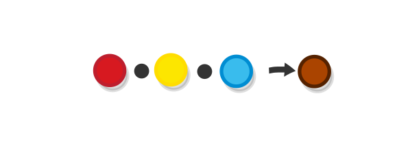
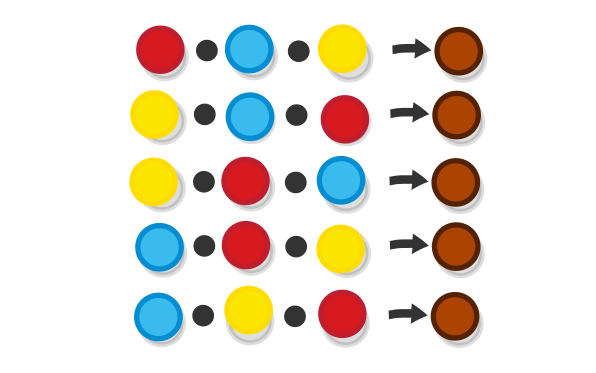
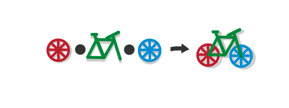
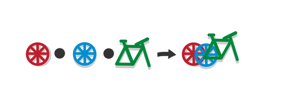
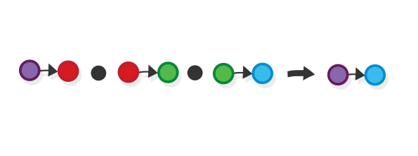
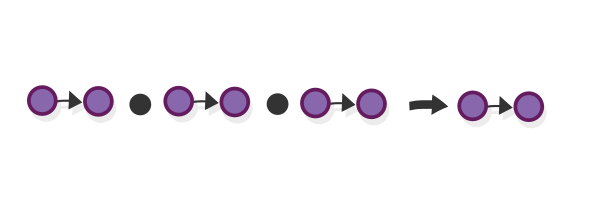
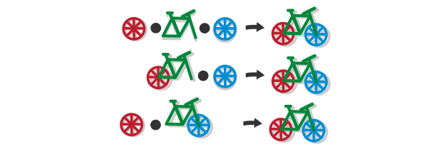
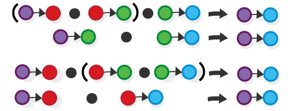
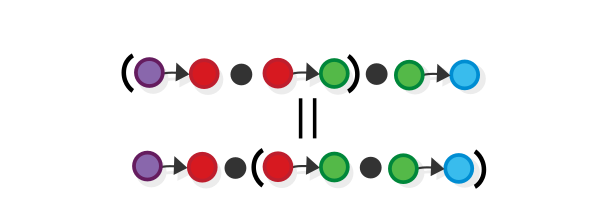
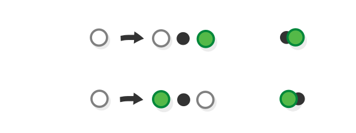

# Associativity and reductionism, and bikes

> If, in some cataclysm, all of scientific knowledge were to be destroyed, and only one sentence passed on to the next generations of creatures, what statement would contain the most information in the fewest words? I believe it is the atomic hypothesis (or the atomic fact, or whatever you wish to call it) that all things are made of atoms—little particles that move around in perpetual motion, attracting each other when they are a little distance apart, but repelling upon being squeezed into one another. In that one sentence, you will see, there is an enormous amount of information about the world, if just a little imagination and thinking are applied. --- Richard Feynman

Associativity --- what does it mean and why is it there? In order to tackle this question, we must first talk about another concept --- the concept of _reductionism_:

Reductionism is the idea that the behaviour of complex phenomena can be understood in terms of a number of _simpler_ and more fundamental phenomena. In other words, that things keep getting simpler and simpler as they get "smaller" (or when they are viewed from a lower level). An example of reductionism is the idea that the behaviour of matter can be understood completely by studying the behaviours of its constituents i.e. atoms (the word means "undividable").

Whether the reductionist view is _universally valid_, i.e. whether it is possible to devise a _theory of everything_ that describes the whole universe with a set of very simple laws, is a question over which we can argue until that universe's inevitable collapse. What is certain, though, is that _reductionism underpins all our understanding_, especially when it comes to science and mathematics --- each scientific discipline is based on a set of simple _fundaments_ (e.g. elementary particles in particle physics, chemical elements in chemistry etc. ) on which it builds on its much more complex theories.

## Commutativity

So, if this principle is so important, it would be beneficial to be able to formalize it (i.e. to translate it into mathematical language), and this is what we will try to do now. One way to state the principle of reductionism is to say that _each thing is nothing but a sum of its parts_ i.e. if we combine the same set of parts, we always get the same result. To formalize that, we get a set of objects (balls) and a way to combine them, (which we will denote with a dot).

So, if we have, a given "recipe", for example

Then, we would also have

Or quite simply

Incidentally, this is the definition of a mathematical law called _commutativity_.

A simple context where this law applies --- the natural numbers are commutative under the operation of addiction, e.g. 1 + 2 = 2 + 1 (we will learn more about this in the chapter on groups).

**Question:** If our objects are sets, what set operations can play the part of the dot in this example (i.e. which ones are commutative)?

## Associativity

Sometimes we observe phenomena that still can be represented as a combination of a given set of fundaments, but only when they are combined in a _specific_ way (as opposed to _any_ combination, as in commutative contexts) e.g. as any mechanic can confirm, a bicycle is indeed just the combination of wheels and frameset...

...but that does not mean that every combination of the above parts constitutes a bicycle. For example, placing the front wheel of the bicycle on the rear end of the frame would result would not result in a working bicycle. And combining two wheels one with another is just not possible.

And, to take a formal example, if function A can be combined with B to get C...

...would not automatically mean that B can be combined with A to get the same result

Side note: composing any function with any other is only possible for functions that have the same set, both as source and target, but even then the end result would not always be the same.

Anyway, we determined that functional composition (as well as bike building) does not obey the law of commutativity i.e. not all functions (or bike parts) compose with all other ones. But still, we know that _some_ of them do, i.e. if you align the function signatures (or in the case of the bicycle if you use the proper parts in the proper places) they would come together seamlessly. So, the _order by which we combine the individual parts doesn't matter for the final outcome_ e.g. when we are assembling a bicycle, it doesn't matter if we attach the front wheel to the frame first, or the back wheel, the result will be the same.

Similarly, when combining functions, each pair of functions can, at any time, be replaced by the function that we get by combining them.

This fact is captured by a more restrictive version of commutativity, that we call _associativity_, which for functions, is usually formulated like this.

Or more generally.

This is the essence of associativity --- the ability to study complex phenomenon by zooming in on a part that you want to examine in a given moment, and looking at it in isolation.

Note that the operator we defined only allows for combining things in one dimension (you can attach a thing left and right, but not up or down). Later we will learn about an extension of the concept of a category theory (called monoidal category) that "supports" working in 2 dimensions.

## Associativity and commutativity

We said that associativity is a more restricted version of commutativity. This is true in a formal way, as we show here. By now, you might realize that a composition operator for morphisms in a given category (the thing we denote by the dot) is itself a morphism, that accepts a pair of morphisms and returns yet another morphism (so $$A \times B \to C$$).

Given a composition operator for a category and one morphism from that same category (in this case the green ball), create two more morphisms (which we call the "curried" morphisms (more in the next chapter)) ($$A \to C$$ and $$B \to C$$) by just fixing the second or the first argument of the operator, correspondingly i.e. a morphism that attaches the green ball at the "front" of the function that we have as an argument (produces its source) and one that attaches it at the "end" (accepting its target as a source).

Now, take two such morphisms, with different directions and different objects and ask yourself: under what conditions would those two morphisms commute i.e. when would that formula be satisfied?

Expanding the formula gives us the answer: they commute when the original dot operator is associative.

Thus, we established a connection between associativity and commutativity.

[Read full chapter]({{site.baseurl}}/02_category/)
