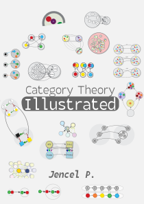

[Buy](https://abuseofnotation.gumroad.com)
--

[Read online](00_about)
--

_Discover the beauty of mathematics through the lens of category theory with this unique exploration that goes beyond problem-solving. In this book, you'll find a refreshing perspective on math as an art form, a language, and a way of thinking that unifies diverse fields of knowledge. Delve into the fascinating world of sets, groups, types, and partial orders, and explore the deep connections between these concepts. Whether you're a curious beginner or a seasoned mathematician, this book offers clear explanations, diagrams, and engaging insights—it's a journey into the heart of mathematics for everyone._

> Category Theory Illustrated is the best introduction to Category Theory I’ve ever seen. It is highly visual, full of useful examples and is extremely clearly written. I highly recommend giving it a try.

[Vitaly Kurin](https://twitter.com/y0b1byte) Machine Learning Research Scientist at Isomorphic Labs

> There is no book on category theory that makes its abstractions so tangible as "Category Theory Illustrated" does. I recommend it for programmers, managers, organizers, designers, or anyone else who values the structure and clarity of information, processes, and relationships.

[Evan Burchard](https://www.oreilly.com/pub/au/7124), Author of "The Web Game Developer's Cookbook" and "Refactoring JavaScript"

> The clarity, consistency and elegance of diagrams in 'Category Theory Illustrated' has helped us demystify and explain in simple terms a topic often feared.

[Gonzalo Casas](https://gnz.io/), Software developer and lecturer at ETH Zurich

> Wow, spent most of this morning chilling in bed and reading this book and it's the first time I've ever felt like I'm getting category theory. Reading other books I'd always be trying to visualise the concepts, but get lost in the sauce...

[Kiran](https://kirancodes.me/) Postdoc Researcher at the University of Illinois Urbana Champaign

Let's talk
===

I want to make this book into the best introductory text, not only to category theory, but to mathematics as a whole. It seems that I would need some help, though.

- I am looking for a *publisher* who is willing to work release this book. You can contact me via [email](mailto:marinovboris@protonmail.com)

- I am also looking for co-authors and/or technical reviewers, who are willing to help with polishing and enriching the text. Post an issue or PR on [Github](https://github.com/abuseofnotation/category-theory-illustrated). 

- And if you want to get the whole version of the book as a pdf or an epub, as well as a lot of additional perks, support me on [Patreon](https://patreon.com/abuseofnotation) or [Ko-fi](https://ko-fi.com/abuseofnotation).

_Thanks to my regular supporters: Artiom Kasapu, Meme Gawd, Al King, David Mankins, Michael Kuzmin, Simon Parry and everyone else who helped me in any way to complete this project._
