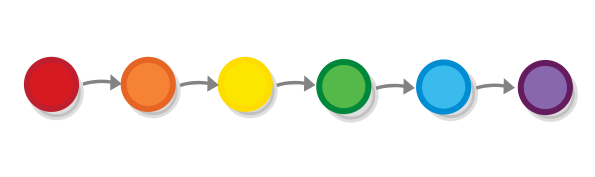
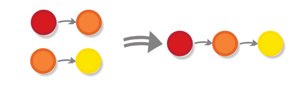
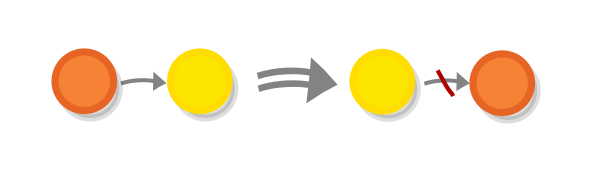
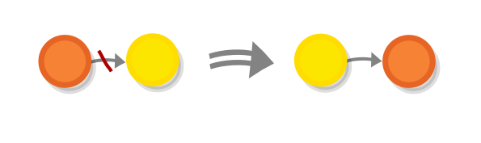

About
===

About category theory
---

> Category Theory is considered by many to be an involved domain of study to get into. It becomes a ground for unification of mathematical ideas for a wide variety of domains. And the way it achieves this is by taking an abstract vantage point on the ideas, their properties, and processes in these disciplines. This viewpoint gives it the ability to reason about analogies happening in distinct domains and draw rigorous analogies across the patterns happening in them in a rigorous way.

[Source](https://github.com/prathyvsh/category-theory-resources)

Category theory has a variety of applications: 

- It is used in **programming language theory**, for example the usage of monads in functional programming. 

- It is used in other scientific disciplines e.g. quantum mechanics:

> [...] The categorical formalization of this result (Abramsky and Coecke, 2004), now referred to as categorical quantum mechanics, became a hit within the computer science semantics community, and ultimately allowed for several young people to establish research careers in this area. **Top computer science conferences (e.g. LiCS and ICALP) indeed regularly accept papers on categorical quantum mechanics, and more recently leading physics journals (e.g. PRL and NJP) have started to do so too**.

Source: Picturing Quantum Processes by Bob Coecke (Cambridge University Press - 2017)

- It may also be used as an axiomatic foundation for mathematics, as an alternative to set theory and other proposed foundations. 

- Last but not least (perhaps even most importantly) category theory has a very good potential as a *teaching tool* for a variety of other subjects.

About the book
---

I am writing a primer in category theory and various related concepts in "higher" mathematics that is *really* accessible to people with no prior exposure to the subject without being dumbed down, by utilizing visual explanations.

My book serves as chapter 0 going through the gist of the material covered by other similar introductory books, but doing so in a way that would enable non-mathematicians to swift through with ease.

Reading it would enable my readers to effortlessly go through any academic introduction to category theory, as well as to start tackling resources that use category theory as a tool to treat other subjects.

About the author
---

I am a Bulgarian nerd who works in web programming with background in design and technical communication. I am into functional programming, from where I first learned about category theory but then started finding math more and more fascinating. 

Born and living in Sofia with my wife and kid.

Similar resources
===

Here is [a good list of category theory introductions](https://github.com/prathyvsh/category-theory-resources)

"Category Theory Illustrated" (which I will call CTI from now on), however possesses some unique features that make it different from the ones that I looked into. Here I will examine those features of CTI when compared specifically to my two favorite introductions, which also target the two biggest target audiences for CTI - programmers (nerds) and scientists (academics).

- Category Theory for Programmers by Bartosz Milewski (self-published- 2018) - [Full text](https://github.com/hmemcpy/milewski-ctfp-pdf/)

- Category Theory for the Sciences by David I. Spivak (MIT press - 2014) - [Free version](http://math.mit.edu/~dspivak/CT4S.pdf)

I am attaching excerpts from both of them, as well as one from CTI, that explain a similar concept - the concept of an *order*.

Category Theory for Programmers
---

> A preorder is a set with an ordering relation between its elements that’s traditionally written as <= (less than or equal). The “pre” in preorder is there because we’re only requiring the relation to be transitive and reflexive but not necessarily antisymmetric (so it’s possible to have cycles).

> A set with the preorder relation gives rise to a category. The objects are the elements of this set. A morphism from object a to b either doesn’t exist, if the objects cannot be compared or if it’s not true that a <= b; or it exists if a <= b, and it points from a to b. There is never more than one morphism from one object to another. Therefore any hom-set in such a category is either an empty set or a one-element set. Such a category is called thin.

> It’s easy to convince yourself that this construction is indeed a category: The arrows are composable because, if a <= b and b <= c then a <= c; and the composition is associative. We also have the identity arrows because every element is (less than or) equal to itself (reflexivity of the underlying relation).

[Source](https://bartoszmilewski.com/2015/10/28/yoneda-embedding/)

Category Theory for the Sciences 
---

> 3.4.1 Definitions of preorder, partial order, linear order

> Definition 3.4.1.1. Let S be a set and R Ď S ˆS a binary relation on S; if ps,s1q P R
we will write s ≤ s1. Then we say that R is a preorder if, for all s,s1,s2 P S we have

> Reflexivity: s ≤ s, and

> Transitivity: if s ≤ s1 and s1 ≤ s2, then s ≤ s2.

> We say that R is a partial order if it is a preorder and, in addition, for all s,s1 P S we
have

> Antisymmetry: If s ≤ s1 and s1 ≤ s, then s “ s1.

> We say that R is a linear order if it is a partial order and, in addition, for all s,s1 P S we have

> Comparability: Either s ≤ s1 or s1 ≤ s.
> We denote such a preorder (or partial order or linear order) by pS,≤ q.

> Exercise 3.4.1.2.
> a.) Decide whether the table to the left in Display (3.9) constitutes a linear order.
> b.) Show that neither of the other tables are even preorders.

[Source](http://math.mit.edu/~dspivak/CT4S.pdf) (page 93)

The categorical aspect of orders is described on page 132 in the same link.

Category Theory Illustrated
---

> The most straightforward type of order that you think about is linear order i.e. one in which every object has its place depending on every other object. In this case the ordering criteria is completely deterministic and leaves no room for ambiguity in terms of which element comes before which. For example, ordering the colors by the length of their waves (or by how they appear in the rainbow).



> In most programming languages, we can order objects linearly by providing a function which, given two objects, tells us which one of them is "bigger" (comes first) and which one is "smaller".

```
[1, 3, 2].sort((a, b) => { 
  if (a > b) {
    return true 
  } else {
    return false
    } 
})
```

> But in order for such a function to really define an order (e.g. give the same output every time, independent of how the objects were shuffled initially), it has to obey several rules. 

> Incidentally, (or rather not incidentally at all), these rules are nearly equivalent to the mathematical laws that define the criteria of the relationship between elements in an order i.e. those are the rules that define which element can point to which. Let's review them.

> Reflexivity 

> Let's get the most boring law out of the way - each object has to be bigger or equal to itself, or **a ≤ a** (the relationship between elements in an order is commonly denoted as **≤** in formulas, but it can also be represented with a simple arrow from first object to the second). 


> No special reason for this law to be so, except that the "base case" should be covered somehow. 

> We can formulate it the opposite way too and say that each object should *not* have the relationship to itself, in which case we would have a relation than resembles *bigger than*, as opposed to *bigger or equal to* and a slightly different type of order, sometimes called a *strict* order.

> Transitivity


> The second law is maybe the least obvious, (but probably the most essential) - it states that if object **a** is bigger than object **b**, it is automatically bigger than all objects that are smaller than object **b** or **a ≤ b and b ≤ c ➞ a ≤ c**. 



> This is the law that to a large extend defines what an order is: if I am better at playing soccer than my grandmother, then I would also be better at it than my grandmother's friend, whom she beats, otherwise I wouldn't really be better than her.

> Antisymmetry

> The third law is called antisymmetry and it states that the function that defines the order should not give contradictory results (or in other words you have **x ≤ y** and **y ≤ x** only if **x = y**). 



> It also means that no ties are permitted - either I am better than my grandmother at soccer or she is better at it than me.

> Totality

> The last law is called *totality* (or *connexity*) and it mandates that all elements that belong to the order should be comparable - **a ≤ b or b ≤ a**. That is, for any two elements, one would always be "bigger" than the other. 

> By the way, this law makes the reflexivity law redundant, as reflexivity is just a special case of totality when **a** and **b** are one and the same object, but I still want to present it for reasons that will become apparent soon.



> You might say that this law is not as self-evident as the rest of them - if you think about different types of real-life objects that we typically order, you would probably think of some situations in which it does not apply. For example, if we aim to order all people based on soccer skills there are many ways in which we can rank a person compared to their friends their friend's friends etc. but there isn't a way to order groups of people who never played with one another.

[Source](/category-theory-illustrated/04_order)

Features
===

Diagrams
---

Category theory is very *visual* in its nature. Category-theoretic diagrams are not merely supplemental illustrations for its concepts, but are often the very language that is used to define those concepts e.g. defining a more advanced concept such as *natural transformation* without diagrams is practically impossible. So having a lot of diagrams is essential for people who are inexperienced to understand the concepts. 

However, books on category theory typically have as many diagrams as other math textbooks. I consider this a huge missed opportunity for making the subject more approachable. This was the original motivation for the creation of CTI.

Besides being more of them, the diagrams of CTI use many techniques from traditional communication design (such as the use of color for example) in order to illuminate the different subjects and abstractions that I am covering.

Both books that I am reviewing have less diagrams than CTI. From the resources that I have examined, the only author who stresses on diagrams as much as I do is Tai-Danae Bradley (her blog is [https://www.math3ma.com/](https://www.math3ma.com/).)

The diagrams in CTI had received universal praise from many audiences. The university professor Gonzalo Casas used some of them for his [lectures on robotic fabrication at ETH Zurich](https://github.com/compas-teaching/COMPAS-II-FS2021/tree/main/lecture_06) ([Lecture slides](https://raw.githubusercontent.com/compas-teaching/COMPAS-II-FS2021/main/lecture_06/lecture_06.pdf).)

Verbosity of language
---

Leaving the diagrams aside, we can see that the descriptions in CTI are much more verbose than equivalent descriptions in other books. This is clearly visible in the excerpts attached: although the authors of the books that I am reviewing have quite different styles of presentation, they both move much faster with the exposition, which would be OK for readers who have prior experience with math and computer science, but would be very hard to follow by lay people (I know that from my own experience). 

In CTI, I try above all to be gentle in my exposition, taking the time to stress out the important parts of the descriptions and the places where misunderstanding might occur, such as the fact that the term "object" has entirely different meanings in computer science and in category theory. 

Chapter on logic
---

Category theory is deeply bound with mathematical logic. But although the connection is mentioned in many books, it isn't fully examined by any introductory texts on category theory that I have seen. 

CTI has a dedicated chapter on logic (the longest one in the book), which introduces the connection and makes use of it to give context to some categorical phenomena, such as limits.

Target audiences
===

The types of audiences of CTI.

Programmers 
---

### who are curious about category theory, because they are into functional programming.

Functional programming is on the rise with both new languages and technologies that are gaining traction (Elixir, Clojure), and mainstream languages, trying to catch up (Java, JavaScript) and so there are many programmers who are interested in functional programming and category theory, but lack the math background to tackle the existing resources. CTI is a way for those people to understand "what the fuss is about" before diving into such technologies. 

Students 
---

### who are studying category-theory-related disciplines

CTI would be of much help for people who want to study category theory or any of the growing number of resources that use category theory and diagrammatic language to introduce other subjects: 

- Picturing Quantum Processes by Bob Coecke and Aleks Kissinger (Cambridge University Press - 2017) that uses it to introduce quantum mechanics

- Visual Group Theory by Nathan Carter (MATHEMATICAL ASSOCIATION OF AMERICA - 2009) sample: http://www.mathcs.emory.edu/~dzb/teaching/421Fall2014/VGT-Ch-1-2.pdf

- "Topology. A Categorical Approach" by Tai-Danae Bradley, Tyler Bryson and John Terilla (MIT press - 2020)

As David Spivak puts it in his review of "Topology. A Categorical Approach":

> This book is at the leading edge of what will **likely become a major pedagogical trend in mathematics: teaching the fundamentals from a categorical perspective**.

CTI aids students who are studying these disciplines by communicating what is considered as a "common knowledge" by category theorists.

Any other kind of nerds 
---
### who want to learn some mathematics just for fun

Aside from being informative, CTI is easy and fun to read so many people read it just as a form of recreation.

Feedback
===

My book received a lot of positive feedback and a lot of people shared it on social media. 

Quotes
---
Attaching the quotes here, see you tomorrow.

    "The range of applications for category theory is immense, and visually conveying meaning through illustration is an indispensable skill for organizational and technical work. Unfortunately, the foundations of category theory, despite much of their utility and simplicity being on par with Venn Diagrams, are locked behind resources that assume far too much academic background.

    As Gilbert Strang offered in his critique of the typical pre-calc, calc (1-3), diff eq courses in "Too Much Calculus" (http://siags.siam.org/siagla/articles/Strang2001.pdf) in favor of linear algebra, similar arguments can be made for promoting statistics, discrete mathematics, or category theory.

    Should category theory be considered for this academic purpose or any work wherein clear thinking and explanations are valued, beginner-appropriate resources are essential. There is no book on category theory that makes its abstractions so tangible as "Category Theory Illustrated" does. I recommend it for programmers, managers, organizers, designers, or anyone else who values the structure and clarity of information, processes, and relationships."

[Evan Burchard](https://www.oreilly.com/pub/au/7124), Author of "The Web Game Developer's Cookbook" and "Refactoring JavaScript"

    "The clarity, consistency and elegance of diagrams in 'Category Theory Illustrated' has helped us demystify and explain in simple terms a topic often feared."

[Gonzalo Casas](https://gnz.io/), Software developer, leading courses at digital/robotic fabrication for PHD students at ETH Zurich


Comments
---

> This is the most beautiful and clearly written introduction to categories I’ve ever seen. Highly recommended. [Source](https://twitter.com/y0b1byte/status/1417567589241339912)

> Great stuff man! Internet needs more accessible Category Theory expositions. [Source](https://twitter.com/prathyvsh/status/1253303971185221634)

> What a wonderful resource this Illustrated Category Theory series is. It's an easy(ier), concise, on-ramp to the topic, that would make a nice introduction. A good resource for sharing. I look forward to the remaining topics. Thanks Boris! [Source](https://www.reddit.com/r/haskell/comments/mhs3ov/category_theory_illustrated/gt9xbp9?utm_source=share&utm_medium=web2x&context=3)

> Awesome website! Well written and crystal clear. It's truly a feat to explain simply such a complex topic. [Source](https://news.ycombinator.com/item?id=26659190)

> My God that site is beautiful. If only every "maths" site could looks like this, I'd have won a field medal! [Source](https://news.ycombinator.com/item?id=26660369)

> I saw your site on Hacker News. I just wanted to send a note saying it's beautiful! I have been writing Haskell (PureScript really) for years, and I've been wanting to get more into Category Theory. I'm excited to read through your site, and thanks for taking the time to create it! (received by email)

> Thank you for creating Category Theory Illustrated, for me the book makes the concepts easier to understand and build an intuition. (received by email)

>  It's pretty cool that you can show the bridge between two different logic systems and it actually is grokkable.  In other words I had no chance of understanding this concept from the Wiki article alone which is where I found it. (received by email)

> What an amazing write-up!
> I've picked up those things peace by peace form Wikipedia to be able to understand the slang in Haskell land. But it was a long and puzzling process. This great summary offered here will hopefully help other people in the future get a coherent picture more quickly. (I hope the SEO is good so people will find it. I'm at least going to recommend it form now on whenever someone asks related questions).[Source](https://news.ycombinator.com/reply?id=28661220&goto=item%3Fid%3D28660157%2328661220)


Discussions
---

[Lobste.rs](https://lobste.rs/s/bc11fo/category_theory_illustrated_monoids)

[HackerNews](https://news.ycombinator.com/item?id=26658111)

[HackerNews again](https://news.ycombinator.com/item?id=28660157)


[Twitter](https://twitter.com/search?q=category-theory-illustrated&src=typed_query&f=live)

